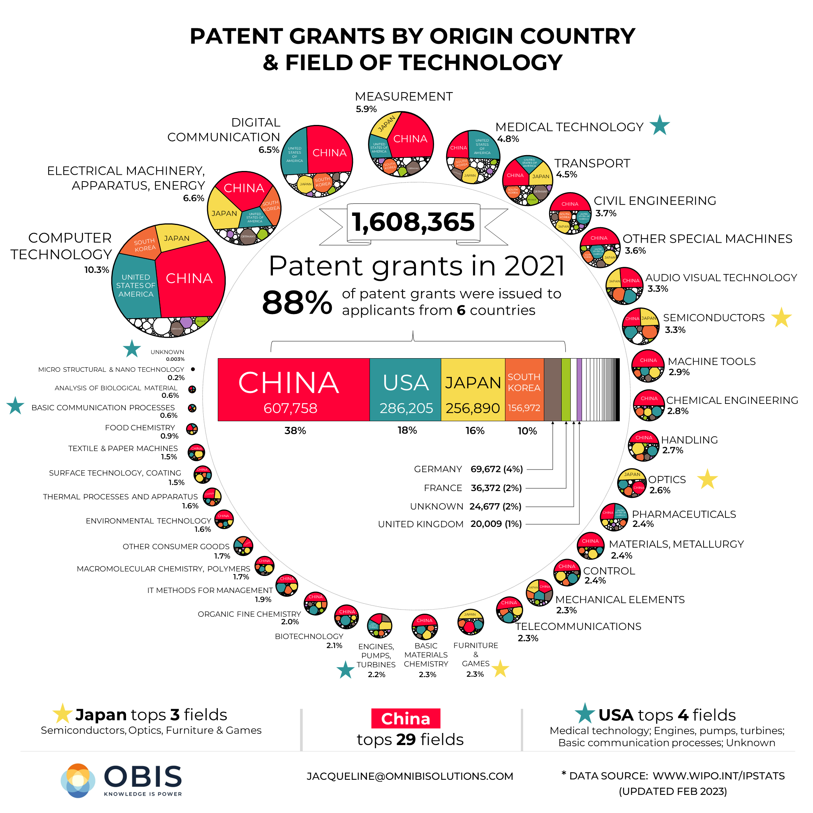

```{r setup, include=FALSE}
# Do not change these settings!
knitr::opts_chunk$set(warning = FALSE, message = FALSE)
```

## Deconstruct

### Original

The original data visualisation selected for the project was as follows:

<br>
<center>

</center>
<center>*Source: Visual Capitalist (2023).*</center>
<br>


### Objective and Audience

The objective and audience of the original data visualisation chosen can be summarised as follows:

**Objective**

This visualisation aims to identify the top countries granted the most number of patents in different fields of technology in 2021. This information is crucial for recognizing the leading nations in technological innovation. Additionally, the visualisation seeks to facilitate a direct comparison of the number of patent grants between countries. This comparison is crucial for reader to evaluate the roles of different nations in the technological landscape.

This visualisation could potentially educate audience, influence audience's behavior and decision-making in the following ways:

- **Educate Audience about Global Trends**
  - It could educate audience about the global landscape of intellectual property and technological innovation. Understanding which countries are at the forefront of patent grants provides valuable insights into the dynamics of the global economy and technology landscape.

- **Guide Investment Decisions**
  - The visualization is designed to influence investment decisions. Recognizing which countries lead in patent grants helps investors identify nations with potential for economic growth and business opportunities. For example, if someone realizes that a certain country is leading in patent grants, it could guide him towards that country for investment opportunities.
  
- **Influence on Innovation Strategies**
  - It could inspire audience to consider the leading countries and fields of technology when developing innovation and research strategies. For example, if a certain country dominates in a specific technology sector, it signifies a concentration of innovative activity and expertise in that area. It could encourage professionals to actively seek and explore collaborations opportunities in that country.

**Audience**

The visualisation is published on "Visual Capitalist" website. It is a digital media company that specializes in creating data visualisation related to economics, finance, technology and global trends. Based on the website content and style, the designer is likely targeting individuals who are interested in understanding certain issues via data-driven visualisation. This includes

- **Students**
  - Seeking in-depth knowledge on specific topics
- **Professionals in Related Fields**
  - Possessing basic topic knowledge and working in related fields
- **Investors**
  - Curious about the economic potential of specific fields
- **Business Leaders**
  - Eager to learn about the latest global trends

Based on the specific article "Which Countries are Granted the Most New Patents?" we chose, the target audience is individuals with an interest in intellectual property, innovation and global economic trends. This includes

- **Inventors**
  - Interested in understanding which countries are at the forefront of innovation, potentially influencing their own inventive decision
- **Entrepreneurs**
  - Eager to identify countries and fields of technology with robust patent activity, which could signal fertile opportunity for business expansion
- **Investors**
  - Curious about which countries are leading in patent grants so they can make informed decisions about investment
- **Policymakers**
  - Aim to stay informed about the latest patent trends so that they can make informed decisions about intellectual property regulations and innovation policies
- **Professionals in fields related to intellectual property law, technology and innovation**
  - Aim to stay updated on patent trends to offer legal advice or strategic counsel to clients and organizations

Based on the tone of the visualisation and the related article, it is informative and analytical. It presents data and facts about patent grants across different countries and technological fields, providing insights into the global landscape of innovation and intellectual property.

The article's detailed analysis and use of specific data points suggest that it is designed for target audience with a keen interest in patents, intellectual property and technology trends. For example, it is likely to be professionals, researchers, policymakers, investors and individuals who are interested in innovation and intellectual property.
  
### Critique

The visualisation chosen had the following three main issues:

* **Issue 1: Data Integrity (Missing Data)**

The presence of missing country data within each field of technology is notable. The attempt to represent country proportions within a circle introduces white circles with empty data labels inside the larger circle. For example, inside "Computer Technology", there are a big white circle and around nine smaller white circles without any labeling. This raises uncertainty regarding whether each white blank circle accurately corresponds to a country. Even there are some little circles with coloring and country labels, their sizes are too small to read. Some colored little circles (e.g. South Korea in "Audio Visual Technology) have missing country labels.

This issue has a substantial impact on the reader's ability to identify the leading countries, as only the top 3 to 4 countries with the largest areas in the circle are identifiable. Identifying the top 5-10 countries is impossible. Furthermore, the inconsistency in data labeling creates a hindrance for readers in following and comprehending the visualization.

* **Issue 2: Perceptual Issue**

The visualization employs circle area to depict the proportion of each field of technology, and within those circles, area is utilized to represent the proportion of each country. Area lack visual accuracy for comparison. Comparing circle area itself is difficult. The visualisation makes it even more difficult as the circles are positioned in a clock-wise round manner. This arrangement impedes the reader's ability to make direct visual comparisons of alternative linear metrics, such as diameter, even though it's not an ideal method for comparing areas.For example, one cannot easily tell the area difference between "Computer technology" and "Electrical machinery, apparatus, energy" until we read the percentage label.

In addition, within every circle, it is even not using pie chart method to distribute the ratio. The dissection is irregular and different for every circle. Comparison between countries are extremely difficult. The irregular and differing dissections across circles further complicates comparisons between countries. For example, in "Computer technology", the areas between "South Korea" and "Japan" look very similar but we could not visually tell which country has a larger area. Employing a simple bar chart would offer a more straightforward and reliable comparison and accurate representation of the data.

The impact of the issue lies in the potential for misinterpretation and difficulty in deriving meaningful insights from the visualization. Using circle area as a means of representation can lead to inaccuracies in comparing proportions, as the human perception of area is not as precise as that of length. This can lead to a reliance on numerical labels to make accurate comparisons, which undermines the effectiveness of the data visualisation.

* **Issue 3: Failure to Answer a Practical Question**

The overall choice of the data visualization method significantly impact the effectiveness of conveying the intended information - which is to identify and rank the leading countries in terms of number of patent grants in different fields of technology, and also to understand the difference in number between countries. These insights are important as they align with the visualisation's objectives defined earlier. 

Nonetheless, the visualization lacks clarity and precision in representing the proportions of patent grants across different countries, the consequence is that the audience might overlook crucial information. This means that investors may not have a clear understanding of which countries are truly leading in patent grants in their respective sectors. As a result, they might miss out on valuable insights that could inform their investment decisions. This oversight could result in missed opportunities for capitalizing on countries that are actually at the forefront of technological advancements. 

The impact of the problem vary depending on the specific target audience. For example, if I were an investor seeking to invest in a less competitive market, I might want to focus on countries ranked 4th-6th. In the original visualization, such information is not clear, making it impossible for me to identify which country holds the 4th or 5th position. This lack of clarity and accuracy could lead to economic value loss for investors who are unable to make informed investment decisions. 

Furthermore, for professionals studying patent grant trends in specific countries, they rely on accurate data visualisation to make informed analyses and draw meaningful conclusions. This issue could potentially hinder their comprehension and impact their ability to provide accurate insights or recommendations based on their findings.

## Reconstruct

### Code

The following code was used to fix the issues identified in the original visualization. 

#### Load Package
```{r}
library(ggplot2)
library(dplyr)
library(grid)
library(forcats)
library(tidytext)
```

#### Read the Data
```{r}
# Read the CSV file
df <- read.csv("data.csv")
```

#### Data Transformation
```{r}
# Convert sector to title case
df$Sector <- tools::toTitleCase(tolower(df$Sector))

# Group the data by Country Name and Sector, then calculate the total count for each combination
df2 <- df %>%
  group_by(Country.Name, Sector) %>%
  summarise(Total_Count = sum(Count)) %>%
  ungroup() %>%
  arrange(desc(Total_Count))

# Rank the countries within each sector based on sum of count
df2 <- df2 %>%
  group_by(Sector) %>%
  mutate(Rank = rank(desc(Total_Count), ties.method = "min"))

# Summarize the data by Sector and Country.Name
df_summarized <- df2 %>%
  group_by(Sector, Country.Name) %>%
  summarise(Total_Count = sum(Total_Count), Rank = first(Rank))

# Define the order of sectors based on total count
sector_order <- df_summarized %>%
  group_by(Sector) %>%
  summarise(Total_Count = sum(Total_Count)) %>%
  arrange(desc(Total_Count)) %>%
  pull(Sector)

# Convert Sector to a factor with the defined order
df_summarized <- df_summarized %>%
  mutate(Sector = factor(Sector, levels = sector_order))

df_sector_total <- df_summarized %>%
  group_by(Sector) %>%
  summarise(Total_Count = sum(Total_Count)) %>%
  arrange(desc(Total_Count))

# Select the top 15 sectors
top15_sectors <- df_sector_total %>%
  top_n(15)

# Filter the data to include only the top 15 sectors
df_top15 <- df_summarized %>%
  filter(Sector %in% top15_sectors$Sector)
  
# Filter the top 10 countries within each sector
df_top10_15 <- df_top15 %>%
  group_by(Sector) %>%
  top_n(10, Total_Count) %>%
  arrange(Sector, Rank)

```

#### Plotting
```{r}
background <- "#EDEFEE"

pal <- c("#F7A9A8","#261447","#DFD6A7","#E84855",
         "#FF9B71","#0038b8","#5C80BC","#F46197",
         "#84BC9C","#FCC8B2","#FDDA4E","#C6D8AF",
         "#590004","#0E4749","#BDADEA","#A37871",
         "#4E4B5C","#AF9B46","#1B998B")

plot <- ggplot(df_top10_15, 
               aes(x = Total_Count, y = reorder_within(Country.Name, Total_Count, Sector), Total_Count,
                   fill = Country.Name)) +
  geom_bar(stat = "identity", position = "dodge") +
  scale_y_reordered() +
  facet_wrap(~ Sector, scales = "free_y", ncol = 3) +
  labs(title = "NUMBER OF PATENT GRANTS IN 2021 BY TOP 15 FIELDS OF TECHNOLOGY",
       subtitle = "CHINA LEADS WITH 11 TOP RANKINGS, FOLLOWED BY JAPAN AND USA",
       caption = "Source: World Intellectual Property Organization (2023) - https://www3.wipo.int/ipstats") +
  theme(plot.title = element_text(size = 14, family = "Arial", face="bold"),
        panel.margin=unit(0,"cm"),
        text = element_text(size = 8, family = "Arial"),
        axis.title = element_blank(),
        axis.ticks.x = element_blank(),
        strip.text = element_text(size = 9, family = "Arial", color = "#151F30"),
        legend.title = element_blank()
        )

plot <- plot +
  scale_fill_manual(values = pal) +
  theme(plot.background = element_rect(fill = background),
        panel.background = element_rect(fill = background),
        strip.background= element_rect(fill = "#DDDDDD"),
        legend.position = "none",
        plot.margin = margin(l = 20, t = 10, b = 10, r = 20))
```


### Reconstruction

The following plot fixes the major issues.

```{r fig.align="center", echo = FALSE}
plot
```

## References

The reference to the original data visualisation choose, the data source(s) used for the reconstruction and any other sources used for this project are as follows:

* Visual Capitalist. (2023, March). These Countries Have the Most New Patents. Visual Capitalist. Retrieved September 16, 2023, from https://www.visualcapitalist.com/cp/countries-new-patents/

* World Intellectual Property Organization. (2023, July). WIPO IP Statistics. Retrieved September 16, 2023, from https://www3.wipo.int/ipstats
